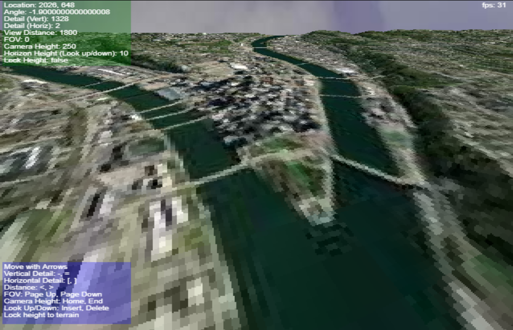

# Pseudo-Voxel Landscape Rasterizer
Software based pseudo-voxels using height maps.

Features Comanche / Outcast style terrain rasterization with no overhanging cliffs or caves.

Not a true voxel, it's basically 2.5D display of a two dimensional data set.

Demo is the Pittsburgh area, obtained from this [City: Skylines map generator](https://heightmap.skydark.pl/)

### Features:
- Movement (Arrow Keys)
- Inc/Dec Vertical Detail (-, = keys)
- Inc/Dec Horizontal Detail ([, ] keys)
- Modify max viewing distance (<, > keys)
- Change FOV (page up, page down keys)
- Modify Camera Height (Home, End keys)
- Pseudo-Look up/down (Ins, Del keys)
- Lock height to terrain (Space key)
    - This is for hovering above the terrain without falling through.
- Sky sourced from (https://unsplash.com/photos/LtWFFVi1RXQ)